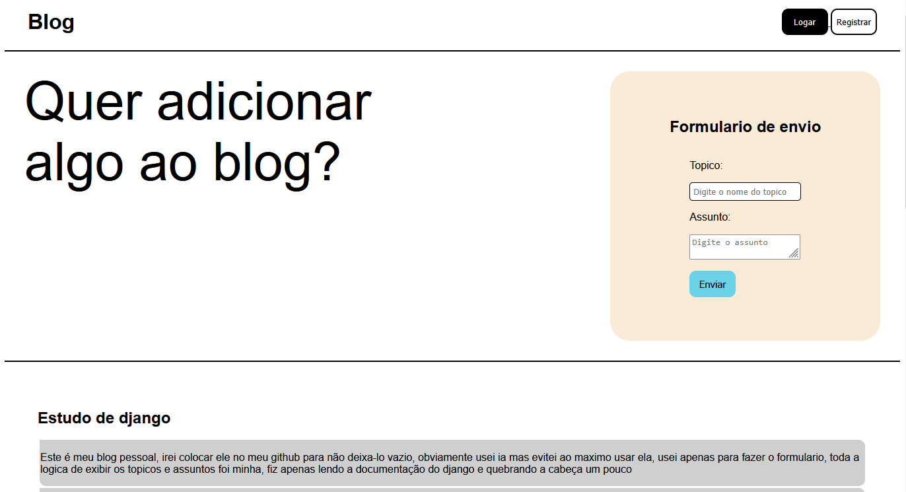

<h1>Blog pessoal</h1>

Fiz este blog na intenção de estudar um pouco mais sobre django, aprendendo como colocar templates e arquivos estaticos (css e imagens) e usar a documentação do django

<h2>Imagem do site:</h2>

Site desenvolvido por: Miguel Silva da Roza
